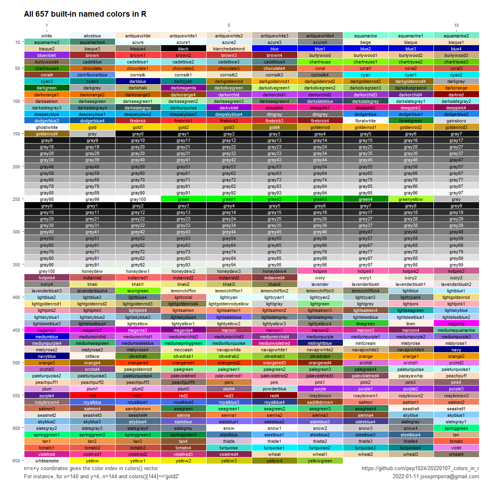

# Named colors in R

Josep M (Pep) Porrà  
2022-01-07

## All colors image

The total number of built-in color names in **R** is 657. The full list
can be obtained with function `colors()` (equivalently, `colours()`). My goal
in this project was to create a picture where all named colors can be
grasped together. This is the final picture:

The code to generate it can be found in the file 
[all_colors_plot.R](Link to file).

## Other information

In addition to this image, I've included the code for three documents:

1. [Show images in Rmarkdown](link to Rpub) briefly explain how to include images in
Rmarkdown documents
1. [Named colors in R Shiny ](link rstudio.io) a simple Shiny page to explore
all named colors and create palettes with them using functions `colorRamp()` and
`colorRampPalette()`
1. [20220107_color_in_r.Rmd](20220107_color_in_r.Rmd) document to test the functions
used in the Shiny document above

